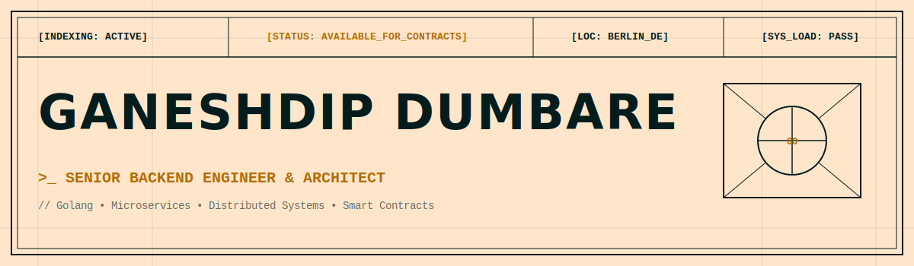

<p align="center">
  
</p>

<div align="center">
  <code>[INDEXING: ACTIVE]</code> &nbsp;•&nbsp;
  <code>[STATUS: AVAILABLE_FOR_CONTRACTS]</code> &nbsp;•&nbsp;
  <code>[LOC: BERLIN_DE]</code> &nbsp;•&nbsp;
  <code>[SYS_LOAD: PASS]</code>
</div>

<br/>

### **SYSTEM_OVERVIEW //**

Experienced **Senior Backend Developer & Architect** with over 8 years of experience in software development, microservices architecture, and blockchain technology. Expert in designing and building scalable backend systems, microservices in **Golang**, authentication frameworks (SSO/SAML/Biometrics), containerization (Docker, Kubernetes, Helm), and smart contract development (Solidity). Recognized for driving software performance, reducing latency, and building AI-driven diagnostic agents to streamline developer pipelines.

---

### **TECHNICAL_ARSENAL //**

<table width="100%">
  <tr>
    <td width="25%" valign="top">
      <strong>LANGUAGES &amp; APIS</strong><br/>
      
      
      
      <br/>
      
      
      
    </td>
    <td width="25%" valign="top">
      <strong>TECHNOLOGIES &amp; CLOUD</strong><br/>
      
      
      
      <br/>
      
      
      
      <br/>
      
      
      
      
      <br/>
      
      
      
      
    </td>
    <td width="25%" valign="top">
      <strong>PRACTICES &amp; DEVOPS</strong><br/>
      
      
      
      <br/>
      
      
      
      <br/>
      
      
      
    </td>
    <td width="25%" valign="top">
      <strong>MONITORING</strong><br/>
      
      
      
      <br/>
      
      
    </td>
  </tr>
</table>

---

### **SYSTEM_DIAGNOSTIC_COMMAND //**

Spin up a local copy of my brutalist web portfolio or read the live telemetry pipeline:

```bash
# Clone the system repository
$ git clone https://github.com/ganeshdipdumbare/portfolio.git

# Navigate and boot up local virtual container
$ cd portfolio && npm install && npm run dev
```

---

###  **PROFESSIONAL_EXPERIENCE //** `[TOTAL_NODES_INDEXED: 8]`

<table width="100%" style="border-collapse: collapse; border: 1px solid rgba(4, 28, 28, 0.15);">
  <!-- Row 1: Qonto & Nord Security -->
  <tr>
    <td width="50%" valign="top" style="border: 1px solid rgba(4, 28, 28, 0.15); padding: 20px; background-color: rgba(4, 28, 28, 0.015);">
      <div align="right"><small style="color: rgba(4, 28, 28, 0.4); font-family: monospace;">[EX_01]</small></div>
      <strong style="color: #b36b00; font-family: monospace; font-size: 13px; text-transform: uppercase; letter-spacing: 0.1em;">Senior Backend Developer</strong>
      <hr style="border: none; border-top: 1px solid rgba(4, 28, 28, 0.12); margin: 10px 0;" />
      <table width="100%" style="font-family: monospace; font-size: 11px; color: rgba(4, 28, 28, 0.8);">
        <tr>
          <td><strong style="color: rgba(4, 28, 28, 0.4);">COMPANY:</strong> Qonto</td>
          <td><strong style="color: rgba(4, 28, 28, 0.4);">PERIOD:</strong> 07/2024 – Present</td>
          <td><strong style="color: rgba(4, 28, 28, 0.4);">LOC:</strong> Berlin</td>
        </tr>
      </table>
      <hr style="border: none; border-top: 1px solid rgba(4, 28, 28, 0.12); margin: 10px 0;" />
      <ul style="font-family: monospace; font-size: 12px; line-height: 1.6; list-style-type: none; padding-left: 0; margin-left: 0; color: rgba(4, 28, 28, 0.9);">
        <li style="margin-bottom: 8px; position: relative; padding-left: 15px;">
          <span style="color: #b36b00; position: absolute; left: 0;">▪</span>
          Working on E-invoicing product, microservices written in <strong>Golang</strong>.
        </li>
        <li style="margin-bottom: 8px; position: relative; padding-left: 15px;">
          <span style="color: #b36b00; position: absolute; left: 0;">▪</span>
          Created AI agent to fix production bugs which resulted into solving quicker and without any manual intervention for some generic cases, reduced time to fix by more than <strong>75%</strong>.
        </li>
        <li style="margin-bottom: 8px; position: relative; padding-left: 15px;">
          <span style="color: #b36b00; position: absolute; left: 0;">▪</span>
          Designed and developed E-invoicing solution for France, Italy, Germany and Spain using the third-party implementation as well as Peppol implementation.
        </li>
        <li style="margin-bottom: 8px; position: relative; padding-left: 15px;">
          <span style="color: #b36b00; position: absolute; left: 0;">▪</span>
          Conducted thorough code reviews that promoted high-quality software development practices amongst team members.
        </li>
        <li style="margin-bottom: 8px; position: relative; padding-left: 15px;">
          <span style="color: #b36b00; position: absolute; left: 0;">▪</span>
          Worked on automation to make use of AI for code reviews using Cursor IDE and also GitHub Copilot PR reviewer to speed up reviews and reduce code review time by more than <strong>50%</strong>.
        </li>
        <li style="margin-bottom: 8px; position: relative; padding-left: 15px;">
          <span style="color: #b36b00; position: absolute; left: 0;">▪</span>
          Onboarded new joiners and standardized process for the same.
        </li>
      </ul>
    </td>
    <td width="50%" valign="top" style="border: 1px solid rgba(4, 28, 28, 0.15); padding: 20px; background-color: rgba(4, 28, 28, 0.015);">
      <div align="right"><small style="color: rgba(4, 28, 28, 0.4); font-family: monospace;">[EX_02]</small></div>
      <strong style="color: #b36b00; font-family: monospace; font-size: 13px; text-transform: uppercase; letter-spacing: 0.1em;">Senior Backend Developer</strong>
      <hr style="border: none; border-top: 1px solid rgba(4, 28, 28, 0.12); margin: 10px 0;" />
      <table width="100%" style="font-family: monospace; font-size: 11px; color: rgba(4, 28, 28, 0.8);">
        <tr>
          <td><strong style="color: rgba(4, 28, 28, 0.4);">COMPANY:</strong> Nord Security</td>
          <td><strong style="color: rgba(4, 28, 28, 0.4);">PERIOD:</strong> 06/2023 – 06/2024</td>
          <td><strong style="color: rgba(4, 28, 28, 0.4);">LOC:</strong> Berlin, Germany</td>
        </tr>
      </table>
      <hr style="border: none; border-top: 1px solid rgba(4, 28, 28, 0.12); margin: 10px 0;" />
      <ul style="font-family: monospace; font-size: 12px; line-height: 1.6; list-style-type: none; padding-left: 0; margin-left: 0; color: rgba(4, 28, 28, 0.9);">
        <li style="margin-bottom: 8px; position: relative; padding-left: 15px;">
          <span style="color: #b36b00; position: absolute; left: 0;">▪</span>
          Worked on NordAccount product, implemented authentication of VPN users, microservices written in <strong>Golang</strong>.
        </li>
        <li style="margin-bottom: 8px; position: relative; padding-left: 15px;">
          <span style="color: #b36b00; position: absolute; left: 0;">▪</span>
          Worked on passwordless authentication which reduced average user login time by more than <strong>50%</strong>.
        </li>
        <li style="margin-bottom: 8px; position: relative; padding-left: 15px;">
          <span style="color: #b36b00; position: absolute; left: 0;">▪</span>
          Designed and built microservices architecture, enabling better scalability and flexibility within application ecosystem.
        </li>
        <li style="margin-bottom: 8px; position: relative; padding-left: 15px;">
          <span style="color: #b36b00; position: absolute; left: 0;">▪</span>
          Worked in passwordless authentication which helped users signing using biometrics to ease use of VPN.
        </li>
        <li style="margin-bottom: 8px; position: relative; padding-left: 15px;">
          <span style="color: #b36b00; position: absolute; left: 0;">▪</span>
          Analyzed system requirements alongside project stakeholders, translating those needs into actionable development tasks for team.
        </li>
        <li style="margin-bottom: 8px; position: relative; padding-left: 15px;">
          <span style="color: #b36b00; position: absolute; left: 0;">▪</span>
          Conducted thorough code reviews that promoted high-quality software development practices amongst team members.
        </li>
        <li style="margin-bottom: 8px; position: relative; padding-left: 15px;">
          <span style="color: #b36b00; position: absolute; left: 0;">▪</span>
          Reduced server downtime by proactively monitoring system health and addressing issues promptly.
        </li>
      </ul>
    </td>
  </tr>
  <!-- Row 2: Solsten & McMakler -->
  <tr>
    <td width="50%" valign="top" style="border: 1px solid rgba(4, 28, 28, 0.15); padding: 20px; background-color: rgba(4, 28, 28, 0.015);">
      <div align="right"><small style="color: rgba(4, 28, 28, 0.4); font-family: monospace;">[EX_03]</small></div>
      <strong style="color: #b36b00; font-family: monospace; font-size: 13px; text-transform: uppercase; letter-spacing: 0.1em;">Backend Engineer</strong>
      <hr style="border: none; border-top: 1px solid rgba(4, 28, 28, 0.12); margin: 10px 0;" />
      <table width="100%" style="font-family: monospace; font-size: 11px; color: rgba(4, 28, 28, 0.8);">
        <tr>
          <td><strong style="color: rgba(4, 28, 28, 0.4);">COMPANY:</strong> Solsten</td>
          <td><strong style="color: rgba(4, 28, 28, 0.4);">PERIOD:</strong> 03/2021 – 05/2022</td>
          <td><strong style="color: rgba(4, 28, 28, 0.4);">LOC:</strong> Berlin, Germany</td>
        </tr>
      </table>
      <hr style="border: none; border-top: 1px solid rgba(4, 28, 28, 0.12); margin: 10px 0;" />
      <ul style="font-family: monospace; font-size: 12px; line-height: 1.6; list-style-type: none; padding-left: 0; margin-left: 0; color: rgba(4, 28, 28, 0.9);">
        <li style="margin-bottom: 8px; position: relative; padding-left: 15px;">
          <span style="color: #b36b00; position: absolute; left: 0;">▪</span>
          Worked on Traits and Frequency products used in analyzing psychological traits of players. Microservices written in <strong>Golang</strong>.
        </li>
        <li style="margin-bottom: 8px; position: relative; padding-left: 15px;">
          <span style="color: #b36b00; position: absolute; left: 0;">▪</span>
          Worked on SSO SAML authentication which allowed customers logging in time reduced by <strong>100%</strong> with their own identity provider.
        </li>
        <li style="margin-bottom: 8px; position: relative; padding-left: 15px;">
          <span style="color: #b36b00; position: absolute; left: 0;">▪</span>
          Collaborated with cross-functional teams like product management and QA to ensure seamless delivery of high-quality products.
        </li>
        <li style="margin-bottom: 8px; position: relative; padding-left: 15px;">
          <span style="color: #b36b00; position: absolute; left: 0;">▪</span>
          Collaborated with frontend developers to design and implement seamless APIs, improving overall product functionality.
        </li>
        <li style="margin-bottom: 8px; position: relative; padding-left: 15px;">
          <span style="color: #b36b00; position: absolute; left: 0;">▪</span>
          Deployed applications using containerization technologies such as Docker and Kubernetes, ensuring consistent runtime environments across development, testing, and production stages.
        </li>
        <li style="margin-bottom: 8px; position: relative; padding-left: 15px;">
          <span style="color: #b36b00; position: absolute; left: 0;">▪</span>
          Ensured proper documentation of codebase, making it easier for other developers to understand and maintain system.
        </li>
      </ul>
    </td>
    <td width="50%" valign="top" style="border: 1px solid rgba(4, 28, 28, 0.15); padding: 20px; background-color: rgba(4, 28, 28, 0.015);">
      <div align="right"><small style="color: rgba(4, 28, 28, 0.4); font-family: monospace;">[EX_04]</small></div>
      <strong style="color: #b36b00; font-family: monospace; font-size: 13px; text-transform: uppercase; letter-spacing: 0.1em;">Backend Engineer</strong>
      <hr style="border: none; border-top: 1px solid rgba(4, 28, 28, 0.12); margin: 10px 0;" />
      <table width="100%" style="font-family: monospace; font-size: 11px; color: rgba(4, 28, 28, 0.8);">
        <tr>
          <td><strong style="color: rgba(4, 28, 28, 0.4);">COMPANY:</strong> McMakler</td>
          <td><strong style="color: rgba(4, 28, 28, 0.4);">PERIOD:</strong> 04/2019 – 12/2020</td>
          <td><strong style="color: rgba(4, 28, 28, 0.4);">LOC:</strong> Berlin, Germany</td>
        </tr>
      </table>
      <hr style="border: none; border-top: 1px solid rgba(4, 28, 28, 0.12); margin: 10px 0;" />
      <ul style="font-family: monospace; font-size: 12px; line-height: 1.6; list-style-type: none; padding-left: 0; margin-left: 0; color: rgba(4, 28, 28, 0.9);">
        <li style="margin-bottom: 8px; position: relative; padding-left: 15px;">
          <span style="color: #b36b00; position: absolute; left: 0;">▪</span>
          Worked on Immoforce product used by real estate brokers to handle real estate sale end to end consists of ads, leads and sale. Microservices written in <strong>Golang</strong>.
        </li>
        <li style="margin-bottom: 8px; position: relative; padding-left: 15px;">
          <span style="color: #b36b00; position: absolute; left: 0;">▪</span>
          Worked on email parser to parse applications for real estate which removed manual application creation in system and saved more than <strong>10%</strong> of time of in-house real estate brokers.
        </li>
        <li style="margin-bottom: 8px; position: relative; padding-left: 15px;">
          <span style="color: #b36b00; position: absolute; left: 0;">▪</span>
          Migrated legacy monolithic applications to modern architectures, minimizing technical debt while maximizing stability and performance improvements.
        </li>
        <li style="margin-bottom: 8px; position: relative; padding-left: 15px;">
          <span style="color: #b36b00; position: absolute; left: 0;">▪</span>
          Collaborated with frontend developers to design and implement seamless APIs, improving overall product functionality.
        </li>
        <li style="margin-bottom: 8px; position: relative; padding-left: 15px;">
          <span style="color: #b36b00; position: absolute; left: 0;">▪</span>
          Improved code quality by implementing unit tests and conducting thorough code reviews, reducing bug occurrence rates.
        </li>
        <li style="margin-bottom: 8px; position: relative; padding-left: 15px;">
          <span style="color: #b36b00; position: absolute; left: 0;">▪</span>
          Evaluated and developed new tools and technologies to help achieve company-level goals using Uber Cadence for service orchestration.
        </li>
      </ul>
    </td>
  </tr>
  <!-- Row 3: Konfidio & BTM HUB -->
  <tr>
    <td width="50%" valign="top" style="border: 1px solid rgba(4, 28, 28, 0.15); padding: 20px; background-color: rgba(4, 28, 28, 0.015);">
      <div align="right"><small style="color: rgba(4, 28, 28, 0.4); font-family: monospace;">[EX_05]</small></div>
      <strong style="color: #b36b00; font-family: monospace; font-size: 13px; text-transform: uppercase; letter-spacing: 0.1em;">Blockchain Developer</strong>
      <hr style="border: none; border-top: 1px solid rgba(4, 28, 28, 0.12); margin: 10px 0;" />
      <table width="100%" style="font-family: monospace; font-size: 11px; color: rgba(4, 28, 28, 0.8);">
        <tr>
          <td><strong style="color: rgba(4, 28, 28, 0.4);">COMPANY:</strong> Konfidio</td>
          <td><strong style="color: rgba(4, 28, 28, 0.4);">PERIOD:</strong> 09/2018 – 02/2019</td>
          <td><strong style="color: rgba(4, 28, 28, 0.4);">LOC:</strong> Berlin, Germany</td>
        </tr>
      </table>
      <hr style="border: none; border-top: 1px solid rgba(4, 28, 28, 0.12); margin: 10px 0;" />
      <ul style="font-family: monospace; font-size: 12px; line-height: 1.6; list-style-type: none; padding-left: 0; margin-left: 0; color: rgba(4, 28, 28, 0.9);">
        <li style="margin-bottom: 8px; position: relative; padding-left: 15px;">
          <span style="color: #b36b00; position: absolute; left: 0;">▪</span>
          Improved efficiency for enterprises using Konfidio Contract Solutions product, resulting in a <strong>30%</strong> reduction in contract processing time. Smart contracts written in Solidity deployed to private Ethereum cluster.
        </li>
        <li style="margin-bottom: 8px; position: relative; padding-left: 15px;">
          <span style="color: #b36b00; position: absolute; left: 0;">▪</span>
          Developed smart contracts for various applications, streamlining business processes and reducing costs.
        </li>
        <li style="margin-bottom: 8px; position: relative; padding-left: 15px;">
          <span style="color: #b36b00; position: absolute; left: 0;">▪</span>
          Setup GitLab pipelines for automated tests and deployment of code changes in PR resulting saving more than <strong>10%</strong> of developers time.
        </li>
        <li style="margin-bottom: 8px; position: relative; padding-left: 15px;">
          <span style="color: #b36b00; position: absolute; left: 0;">▪</span>
          Analyzed system requirements and designed customized blockchain architectures tailored to specific use cases.
        </li>
        <li style="margin-bottom: 8px; position: relative; padding-left: 15px;">
          <span style="color: #b36b00; position: absolute; left: 0;">▪</span>
          Collaborated with cross-functional teams to integrate blockchain technology into existing systems, improving overall efficiency.
        </li>
        <li style="margin-bottom: 8px; position: relative; padding-left: 15px;">
          <span style="color: #b36b00; position: absolute; left: 0;">▪</span>
          Participated in industry conferences as speaker or panelist, sharing insights on recent developments in field of blockchain technology.
        </li>
      </ul>
    </td>
    <td width="50%" valign="top" style="border: 1px solid rgba(4, 28, 28, 0.15); padding: 20px; background-color: rgba(4, 28, 28, 0.015);">
      <div align="right"><small style="color: rgba(4, 28, 28, 0.4); font-family: monospace;">[EX_06]</small></div>
      <strong style="color: #b36b00; font-family: monospace; font-size: 13px; text-transform: uppercase; letter-spacing: 0.1em;">Blockchain Developer</strong>
      <hr style="border: none; border-top: 1px solid rgba(4, 28, 28, 0.12); margin: 10px 0;" />
      <table width="100%" style="font-family: monospace; font-size: 11px; color: rgba(4, 28, 28, 0.8);">
        <tr>
          <td><strong style="color: rgba(4, 28, 28, 0.4);">COMPANY:</strong> BTM HUB</td>
          <td><strong style="color: rgba(4, 28, 28, 0.4);">PERIOD:</strong> 04/2018 – 09/2018</td>
          <td><strong style="color: rgba(4, 28, 28, 0.4);">LOC:</strong> Cyberjaya, Malaysia</td>
        </tr>
      </table>
      <hr style="border: none; border-top: 1px solid rgba(4, 28, 28, 0.12); margin: 10px 0;" />
      <ul style="font-family: monospace; font-size: 12px; line-height: 1.6; list-style-type: none; padding-left: 0; margin-left: 0; color: rgba(4, 28, 28, 0.9);">
        <li style="margin-bottom: 8px; position: relative; padding-left: 15px;">
          <span style="color: #b36b00; position: absolute; left: 0;">▪</span>
          Worked on building blockchain products for clients mainly on blockchain platform. Smart contracts written in Solidity deployed to private Ethereum cluster.
        </li>
        <li style="margin-bottom: 8px; position: relative; padding-left: 15px;">
          <span style="color: #b36b00; position: absolute; left: 0;">▪</span>
          Worked on automating deployment of smart contract using Truffle and Genache results in <strong>5%</strong> reduction in development time.
        </li>
        <li style="margin-bottom: 8px; position: relative; padding-left: 15px;">
          <span style="color: #b36b00; position: absolute; left: 0;">▪</span>
          Assisted clients in understanding benefits of adopting blockchain technology within their organizations through presentations and workshops.
        </li>
        <li style="margin-bottom: 8px; position: relative; padding-left: 15px;">
          <span style="color: #b36b00; position: absolute; left: 0;">▪</span>
          Developed smart contracts for various applications, streamlining business processes and reducing costs.
        </li>
        <li style="margin-bottom: 8px; position: relative; padding-left: 15px;">
          <span style="color: #b36b00; position: absolute; left: 0;">▪</span>
          Mentored junior developers on best practices in coding and software design principles related to blockchain development.
        </li>
        <li style="margin-bottom: 8px; position: relative; padding-left: 15px;">
          <span style="color: #b36b00; position: absolute; left: 0;">▪</span>
          Tested and validated blockchain solutions to ensure reliability and accuracy in real-world applications.
        </li>
      </ul>
    </td>
  </tr>
  <!-- Row 4: Cerillion & Amdocs -->
  <tr>
    <td width="50%" valign="top" style="border: 1px solid rgba(4, 28, 28, 0.15); padding: 20px; background-color: rgba(4, 28, 28, 0.015);">
      <div align="right"><small style="color: rgba(4, 28, 28, 0.4); font-family: monospace;">[EX_07]</small></div>
      <strong style="color: #b36b00; font-family: monospace; font-size: 13px; text-transform: uppercase; letter-spacing: 0.1em;">Programmer Analyst</strong>
      <hr style="border: none; border-top: 1px solid rgba(4, 28, 28, 0.12); margin: 10px 0;" />
      <table width="100%" style="font-family: monospace; font-size: 11px; color: rgba(4, 28, 28, 0.8);">
        <tr>
          <td><strong style="color: rgba(4, 28, 28, 0.4);">COMPANY:</strong> Cerillion Technologies</td>
          <td><strong style="color: rgba(4, 28, 28, 0.4);">PERIOD:</strong> 07/2017 – 04/2018</td>
          <td><strong style="color: rgba(4, 28, 28, 0.4);">LOC:</strong> Pune, India</td>
        </tr>
      </table>
      <hr style="border: none; border-top: 1px solid rgba(4, 28, 28, 0.12); margin: 10px 0;" />
      <ul style="font-family: monospace; font-size: 12px; line-height: 1.6; list-style-type: none; padding-left: 0; margin-left: 0; color: rgba(4, 28, 28, 0.9);">
        <li style="margin-bottom: 8px; position: relative; padding-left: 15px;">
          <span style="color: #b36b00; position: absolute; left: 0;">▪</span>
          Worked on Telecom billing software used by Airtel and BTC. Worked on services written in **C**.
        </li>
        <li style="margin-bottom: 8px; position: relative; padding-left: 15px;">
          <span style="color: #b36b00; position: absolute; left: 0;">▪</span>
          Worked on refactoring report generation process to reduce time by around <strong>15%</strong>.
        </li>
        <li style="margin-bottom: 8px; position: relative; padding-left: 15px;">
          <span style="color: #b36b00; position: absolute; left: 0;">▪</span>
          Designed, developed and optimized code quality through regular peer reviews, resulting in fewer defects and easier maintenance.
        </li>
        <li style="margin-bottom: 8px; position: relative; padding-left: 15px;">
          <span style="color: #b36b00; position: absolute; left: 0;">▪</span>
          Improved software efficiency by identifying and resolving programming errors in existing systems.
        </li>
        <li style="margin-bottom: 8px; position: relative; padding-left: 15px;">
          <span style="color: #b36b00; position: absolute; left: 0;">▪</span>
          Increased application reliability by conducting thorough testing and debugging activities prior to deployment.
        </li>
        <li style="margin-bottom: 8px; position: relative; padding-left: 15px;">
          <span style="color: #b36b00; position: absolute; left: 0;">▪</span>
          Facilitated knowledge transfer amongst team members by creating comprehensive technical documentation for developed solutions.
        </li>
      </ul>
    </td>
    <td width="50%" valign="top" style="border: 1px solid rgba(4, 28, 28, 0.15); padding: 20px; background-color: rgba(4, 28, 28, 0.015);">
      <div align="right"><small style="color: rgba(4, 28, 28, 0.4); font-family: monospace;">[EX_08]</small></div>
      <strong style="color: #b36b00; font-family: monospace; font-size: 13px; text-transform: uppercase; letter-spacing: 0.1em;">Software Developer</strong>
      <hr style="border: none; border-top: 1px solid rgba(4, 28, 28, 0.12); margin: 10px 0;" />
      <table width="100%" style="font-family: monospace; font-size: 11px; color: rgba(4, 28, 28, 0.8);">
        <tr>
          <td><strong style="color: rgba(4, 28, 28, 0.4);">COMPANY:</strong> Amdocs</td>
          <td><strong style="color: rgba(4, 28, 28, 0.4);">PERIOD:</strong> 10/2014 – 07/2017</td>
          <td><strong style="color: rgba(4, 28, 28, 0.4);">LOC:</strong> Pune, India</td>
        </tr>
      </table>
      <hr style="border: none; border-top: 1px solid rgba(4, 28, 28, 0.12); margin: 10px 0;" />
      <ul style="font-family: monospace; font-size: 12px; line-height: 1.6; list-style-type: none; padding-left: 0; margin-left: 0; color: rgba(4, 28, 28, 0.9);">
        <li style="margin-bottom: 8px; position: relative; padding-left: 15px;">
          <span style="color: #b36b00; position: absolute; left: 0;">▪</span>
          Worked on Ensemble CRM product used by customer service representative of T-Mobile US and Bell Canada. Worked on services written in **C**.
        </li>
        <li style="margin-bottom: 8px; position: relative; padding-left: 15px;">
          <span style="color: #b36b00; position: absolute; left: 0;">▪</span>
          Collaborated with cross-functional teams to deliver high-quality products on tight deadlines.
        </li>
        <li style="margin-bottom: 8px; position: relative; padding-left: 15px;">
          <span style="color: #b36b00; position: absolute; left: 0;">▪</span>
          Contributed to positive team environment through effective communication, problem-solving, and collaboration skills.
        </li>
        <li style="margin-bottom: 8px; position: relative; padding-left: 15px;">
          <span style="color: #b36b00; position: absolute; left: 0;">▪</span>
          Created comprehensive documentation detailing software functionality for future reference or maintenance purposes.
        </li>
        <li style="margin-bottom: 8px; position: relative; padding-left: 15px;">
          <span style="color: #b36b00; position: absolute; left: 0;">▪</span>
          Worked on support call and handled more than <strong>80%</strong> of client's issues.
        </li>
        <li style="margin-bottom: 8px; position: relative; padding-left: 15px;">
          <span style="color: #b36b00; position: absolute; left: 0;">▪</span>
          Designed customized solutions for proposals to potential customers.
        </li>
      </ul>
    </td>
  </tr>
</table>

---

###  **LICENSES_&_CERTIFICATIONS //** `[VERIFIED_QUALIFICATIONS_SYNCED: 10]`

<table width="100%" style="border-collapse: collapse; border: 1px solid rgba(4, 28, 28, 0.15);">
  <!-- Row 1: 01, 02, 03 -->
  <tr>
    <td width="33.33%" valign="top" style="border: 1px solid rgba(4, 28, 28, 0.15); padding: 20px; background-color: rgba(4, 28, 28, 0.015);">
      <div align="right"><small style="color: rgba(4, 28, 28, 0.4); font-family: monospace;">[CERT_01]</small></div>
      <strong style="color: #b36b00; font-family: monospace; font-size: 13px; text-transform: uppercase;">Agentic AI</strong>
      <hr style="border: none; border-top: 1px solid rgba(4, 28, 28, 0.12); margin: 8px 0;" />
      <div style="font-family: monospace; font-size: 11px; color: rgba(4, 28, 28, 0.8); line-height: 1.6;">
        <strong style="color: rgba(4, 28, 28, 0.4);">ISSUER:</strong> DeepLearning.AI<br/>
        <strong style="color: rgba(4, 28, 28, 0.4);">DATE:</strong> 11/2025<br/>
        <strong style="color: rgba(4, 28, 28, 0.4);">VERIFY_ID:</strong> Skills: Agents, AI
      </div>
      <br/>
      <div align="left"><span style="font-family: monospace; font-size: 9px; color: rgba(4, 28, 28, 0.4); font-weight: bold;">VERIFIED // SYSTEM_SECURE</span></div>
    </td>
    <td width="33.33%" valign="top" style="border: 1px solid rgba(4, 28, 28, 0.15); padding: 20px; background-color: rgba(4, 28, 28, 0.015);">
      <div align="right"><small style="color: rgba(4, 28, 28, 0.4); font-family: monospace;">[CERT_02]</small></div>
      <strong style="color: #b36b00; font-family: monospace; font-size: 13px; text-transform: uppercase;">Large Language Models: Application through Production</strong>
      <hr style="border: none; border-top: 1px solid rgba(4, 28, 28, 0.12); margin: 8px 0;" />
      <div style="font-family: monospace; font-size: 11px; color: rgba(4, 28, 28, 0.8); line-height: 1.6;">
        <strong style="color: rgba(4, 28, 28, 0.4);">ISSUER:</strong> edX<br/>
        <strong style="color: rgba(4, 28, 28, 0.4);">DATE:</strong> 03/2024<br/>
        <strong style="color: rgba(4, 28, 28, 0.4);">VERIFY_ID:</strong> afd9bd5892624d8c9df7aebf4b2486cd
      </div>
      <br/>
      <div align="left"><span style="font-family: monospace; font-size: 9px; color: rgba(4, 28, 28, 0.4); font-weight: bold;">VERIFIED // SYSTEM_SECURE</span></div>
    </td>
    <td width="33.33%" valign="top" style="border: 1px solid rgba(4, 28, 28, 0.15); padding: 20px; background-color: rgba(4, 28, 28, 0.015);">
      <div align="right"><small style="color: rgba(4, 28, 28, 0.4); font-family: monospace;">[CERT_03]</small></div>
      <strong style="color: #b36b00; font-family: monospace; font-size: 13px; text-transform: uppercase;">Domain Driven Design Made Easy</strong>
      <hr style="border: none; border-top: 1px solid rgba(4, 28, 28, 0.12); margin: 8px 0;" />
      <div style="font-family: monospace; font-size: 11px; color: rgba(4, 28, 28, 0.8); line-height: 1.6;">
        <strong style="color: rgba(4, 28, 28, 0.4);">ISSUER:</strong> Educative<br/>
        <strong style="color: rgba(4, 28, 28, 0.4);">DATE:</strong> 01/2023<br/>
        <strong style="color: rgba(4, 28, 28, 0.4);">VERIFY_ID:</strong> k5m3gACX78GnwynlYUkOnPGBQyQGsn
      </div>
      <br/>
      <div align="left"><span style="font-family: monospace; font-size: 9px; color: rgba(4, 28, 28, 0.4); font-weight: bold;">VERIFIED // SYSTEM_SECURE</span></div>
    </td>
  </tr>
  <!-- Row 2: 04, 05, 06 -->
  <tr>
    <td width="33.33%" valign="top" style="border: 1px solid rgba(4, 28, 28, 0.15); padding: 20px; background-color: rgba(4, 28, 28, 0.015);">
      <div align="right"><small style="color: rgba(4, 28, 28, 0.4); font-family: monospace;">[CERT_04]</small></div>
      <strong style="color: #b36b00; font-family: monospace; font-size: 13px; text-transform: uppercase;">Pragmatic System Design</strong>
      <hr style="border: none; border-top: 1px solid rgba(4, 28, 28, 0.12); margin: 8px 0;" />
      <div style="font-family: monospace; font-size: 11px; color: rgba(4, 28, 28, 0.8); line-height: 1.6;">
        <strong style="color: rgba(4, 28, 28, 0.4);">ISSUER:</strong> Udemy<br/>
        <strong style="color: rgba(4, 28, 28, 0.4);">DATE:</strong> 07/2022<br/>
        <strong style="color: rgba(4, 28, 28, 0.4);">VERIFY_ID:</strong> UC-419150cb-4eb2-44cc-82b4-7471a59d69b9
      </div>
      <br/>
      <div align="left"><span style="font-family: monospace; font-size: 9px; color: rgba(4, 28, 28, 0.4); font-weight: bold;">VERIFIED // SYSTEM_SECURE</span></div>
    </td>
    <td width="33.33%" valign="top" style="border: 1px solid rgba(4, 28, 28, 0.15); padding: 20px; background-color: rgba(4, 28, 28, 0.015);">
      <div align="right"><small style="color: rgba(4, 28, 28, 0.4); font-family: monospace;">[CERT_05]</small></div>
      <strong style="color: #b36b00; font-family: monospace; font-size: 13px; text-transform: uppercase;">Microservices: Designing Highly Scalable Systems</strong>
      <hr style="border: none; border-top: 1px solid rgba(4, 28, 28, 0.12); margin: 8px 0;" />
      <div style="font-family: monospace; font-size: 11px; color: rgba(4, 28, 28, 0.8); line-height: 1.6;">
        <strong style="color: rgba(4, 28, 28, 0.4);">ISSUER:</strong> Udemy<br/>
        <strong style="color: rgba(4, 28, 28, 0.4);">DATE:</strong> 07/2022<br/>
        <strong style="color: rgba(4, 28, 28, 0.4);">VERIFY_ID:</strong> UC-0526207a-d7e3-48ac-9221-59b2fab5aeee
      </div>
      <br/>
      <div align="left"><span style="font-family: monospace; font-size: 9px; color: rgba(4, 28, 28, 0.4); font-weight: bold;">VERIFIED // SYSTEM_SECURE</span></div>
    </td>
    <td width="33.33%" valign="top" style="border: 1px solid rgba(4, 28, 28, 0.15); padding: 20px; background-color: rgba(4, 28, 28, 0.015);">
      <div align="right"><small style="color: rgba(4, 28, 28, 0.4); font-family: monospace;">[CERT_06]</small></div>
      <strong style="color: #b36b00; font-family: monospace; font-size: 13px; text-transform: uppercase;">Ultimate Kubernetes</strong>
      <hr style="border: none; border-top: 1px solid rgba(4, 28, 28, 0.12); margin: 8px 0;" />
      <div style="font-family: monospace; font-size: 11px; color: rgba(4, 28, 28, 0.8); line-height: 1.6;">
        <strong style="color: rgba(4, 28, 28, 0.4);">ISSUER:</strong> Udemy<br/>
        <strong style="color: rgba(4, 28, 28, 0.4);">DATE:</strong> 07/2022<br/>
        <strong style="color: rgba(4, 28, 28, 0.4);">VERIFY_ID:</strong> UC-ae678fdf-e684-4172-be67-c3aad9e44fd5
      </div>
      <br/>
      <div align="left"><span style="font-family: monospace; font-size: 9px; color: rgba(4, 28, 28, 0.4); font-weight: bold;">VERIFIED // SYSTEM_SECURE</span></div>
    </td>
  </tr>
  <!-- Row 3: 07, 08, 09 -->
  <tr>
    <td width="33.33%" valign="top" style="border: 1px solid rgba(4, 28, 28, 0.15); padding: 20px; background-color: rgba(4, 28, 28, 0.015);">
      <div align="right"><small style="color: rgba(4, 28, 28, 0.4); font-family: monospace;">[CERT_07]</small></div>
      <strong style="color: #b36b00; font-family: monospace; font-size: 13px; text-transform: uppercase;">Programming with Google Go</strong>
      <hr style="border: none; border-top: 1px solid rgba(4, 28, 28, 0.12); margin: 8px 0;" />
      <div style="font-family: monospace; font-size: 11px; color: rgba(4, 28, 28, 0.8); line-height: 1.6;">
        <strong style="color: rgba(4, 28, 28, 0.4);">ISSUER:</strong> University of California, Irvine<br/>
        <strong style="color: rgba(4, 28, 28, 0.4);">DATE:</strong> 05/2020<br/>
        <strong style="color: rgba(4, 28, 28, 0.4);">VERIFY_ID:</strong> MPW82DUCG8F8
      </div>
      <br/>
      <div align="left"><span style="font-family: monospace; font-size: 9px; color: rgba(4, 28, 28, 0.4); font-weight: bold;">VERIFIED // SYSTEM_SECURE</span></div>
    </td>
    <td width="33.33%" valign="top" style="border: 1px solid rgba(4, 28, 28, 0.15); padding: 20px; background-color: rgba(4, 28, 28, 0.015);">
      <div align="right"><small style="color: rgba(4, 28, 28, 0.4); font-family: monospace;">[CERT_08]</small></div>
      <strong style="color: #b36b00; font-family: monospace; font-size: 13px; text-transform: uppercase;">Kubernetes for the Absolute Beginners</strong>
      <hr style="border: none; border-top: 1px solid rgba(4, 28, 28, 0.12); margin: 8px 0;" />
      <div style="font-family: monospace; font-size: 11px; color: rgba(4, 28, 28, 0.8); line-height: 1.6;">
        <strong style="color: rgba(4, 28, 28, 0.4);">ISSUER:</strong> KodeKloud<br/>
        <strong style="color: rgba(4, 28, 28, 0.4);">DATE:</strong> 03/2019<br/>
        <strong style="color: rgba(4, 28, 28, 0.4);">VERIFY_ID:</strong> cert_mmnhtgyq
      </div>
      <br/>
      <div align="left"><span style="font-family: monospace; font-size: 9px; color: rgba(4, 28, 28, 0.4); font-weight: bold;">VERIFIED // SYSTEM_SECURE</span></div>
    </td>
    <td width="33.33%" valign="top" style="border: 1px solid rgba(4, 28, 28, 0.15); padding: 20px; background-color: rgba(4, 28, 28, 0.015);">
      <div align="right"><small style="color: rgba(4, 28, 28, 0.4); font-family: monospace;">[CERT_09]</small></div>
      <strong style="color: #b36b00; font-family: monospace; font-size: 13px; text-transform: uppercase;">Certified Blockchain Developer</strong>
      <hr style="border: none; border-top: 1px solid rgba(4, 28, 28, 0.12); margin: 8px 0;" />
      <div style="font-family: monospace; font-size: 11px; color: rgba(4, 28, 28, 0.8); line-height: 1.6;">
        <strong style="color: rgba(4, 28, 28, 0.4);">ISSUER:</strong> Blockchain Council<br/>
        <strong style="color: rgba(4, 28, 28, 0.4);">DATE:</strong> 12/2017<br/>
        <strong style="color: rgba(4, 28, 28, 0.4);">VERIFY_ID:</strong> 11100219
      </div>
      <br/>
      <div align="left"><span style="font-family: monospace; font-size: 9px; color: rgba(4, 28, 28, 0.4); font-weight: bold;">VERIFIED // SYSTEM_SECURE</span></div>
    </td>
  </tr>
  <!-- Row 4: 10 -->
  <tr>
    <td width="33.33%" valign="top" style="border: 1px solid rgba(4, 28, 28, 0.15); padding: 20px; background-color: rgba(4, 28, 28, 0.015);">
      <div align="right"><small style="color: rgba(4, 28, 28, 0.4); font-family: monospace;">[CERT_10]</small></div>
      <strong style="color: #b36b00; font-family: monospace; font-size: 13px; text-transform: uppercase;">IBM Blockchain Essentials</strong>
      <hr style="border: none; border-top: 1px solid rgba(4, 28, 28, 0.12); margin: 8px 0;" />
      <div style="font-family: monospace; font-size: 11px; color: rgba(4, 28, 28, 0.8); line-height: 1.6;">
        <strong style="color: rgba(4, 28, 28, 0.4);">ISSUER:</strong> IBM<br/>
        <strong style="color: rgba(4, 28, 28, 0.4);">DATE:</strong> 12/2017<br/>
        <strong style="color: rgba(4, 28, 28, 0.4);">VERIFY_ID:</strong> Verified Credential
      </div>
      <br/>
      <div align="left"><span style="font-family: monospace; font-size: 9px; color: rgba(4, 28, 28, 0.4); font-weight: bold;">VERIFIED // SYSTEM_SECURE</span></div>
    </td>
    <!-- empty cells to balance layout -->
    <td width="33.33%" style="border: 1px solid rgba(4, 28, 28, 0.15); background-color: transparent;">&nbsp;</td>
    <td width="33.33%" style="border: 1px solid rgba(4, 28, 28, 0.15); background-color: transparent;">&nbsp;</td>
  </tr>
</table>

---

###  **ACADEMICS_&_PERSONAL_TELEMETRY //**

<table width="100%" style="border-collapse: collapse; border: 1px solid rgba(4, 28, 28, 0.15);">
  <tr>
    <!-- Education 1 -->
    <td width="33.33%" valign="top" style="border: 1px solid rgba(4, 28, 28, 0.15); padding: 20px; background-color: rgba(4, 28, 28, 0.015);">
      <div align="right"><small style="color: rgba(4, 28, 28, 0.4); font-family: monospace;">[EDU_01]</small></div>
      <strong style="color: #b36b00; font-family: monospace; font-size: 13px; text-transform: uppercase;">Bachelor Of Engineering</strong>
      <hr style="border: none; border-top: 1px solid rgba(4, 28, 28, 0.12); margin: 10px 0;" />
      <div style="font-family: monospace; font-size: 11px; color: rgba(4, 28, 28, 0.8); line-height: 1.6;">
        <strong style="color: rgba(4, 28, 28, 0.4);">INSTITUTION:</strong> Sinhgad College Of Engineering<br/>
        <strong style="color: rgba(4, 28, 28, 0.4);">LOCATION:</strong> Pune, India
      </div>
      <br/><br/>
      <div align="left">
        <span style="font-family: monospace; font-size: 9px; font-weight: bold; color: #b36b00; border: 1px solid rgba(179, 107, 0, 0.3); background-color: rgba(179, 107, 0, 0.05); padding: 3px 8px;">
          GRADUATED // 04/2014
        </span>
      </div>
    </td>
    <!-- Education 2 -->
    <td width="33.33%" valign="top" style="border: 1px solid rgba(4, 28, 28, 0.15); padding: 20px; background-color: rgba(4, 28, 28, 0.015);">
      <div align="right"><small style="color: rgba(4, 28, 28, 0.4); font-family: monospace;">[EDU_02]</small></div>
      <strong style="color: #b36b00; font-family: monospace; font-size: 13px; text-transform: uppercase;">Higher Secondary School</strong>
      <hr style="border: none; border-top: 1px solid rgba(4, 28, 28, 0.12); margin: 10px 0;" />
      <div style="font-family: monospace; font-size: 11px; color: rgba(4, 28, 28, 0.8); line-height: 1.6;">
        <strong style="color: rgba(4, 28, 28, 0.4);">INSTITUTION:</strong> Jawahar Navodaya Vidyalaya<br/>
        <strong style="color: rgba(4, 28, 28, 0.4);">LOCATION:</strong> Nashik, India
      </div>
      <br/><br/>
      <div align="left">
        <span style="font-family: monospace; font-size: 9px; font-weight: bold; color: #b36b00; border: 1px solid rgba(179, 107, 0, 0.3); background-color: rgba(179, 107, 0, 0.05); padding: 3px 8px;">
          GRADUATED // 03/2010
        </span>
      </div>
    </td>
    <!-- Interests -->
    <td width="33.33%" valign="top" style="border: 1px solid rgba(4, 28, 28, 0.15); padding: 20px; background-color: rgba(4, 28, 28, 0.015);">
      <div align="right"><small style="color: rgba(4, 28, 28, 0.4); font-family: monospace;">[PERS_01]</small></div>
      <strong style="color: #b36b00; font-family: monospace; font-size: 13px; text-transform: uppercase;">OUT-OF-OFFICE // INTERESTS</strong>
      <hr style="border: none; border-top: 1px solid rgba(4, 28, 28, 0.12); margin: 10px 0;" />
      <div style="font-family: monospace; margin-top: 10px; line-height: 2.2;">
        <span style="display: inline-block; font-size: 11px; color: #041c1c; background-color: rgba(4, 28, 28, 0.05); border: 1px solid rgba(4, 28, 28, 0.15); padding: 4px 10px; margin: 0 4px 6px 0;">Running 🏃</span>
        <span style="display: inline-block; font-size: 11px; color: #041c1c; background-color: rgba(4, 28, 28, 0.05); border: 1px solid rgba(4, 28, 28, 0.15); padding: 4px 10px; margin: 0 4px 6px 0;">Cycling 🚴</span>
        <span style="display: inline-block; font-size: 11px; color: #041c1c; background-color: rgba(4, 28, 28, 0.05); border: 1px solid rgba(4, 28, 28, 0.15); padding: 4px 10px; margin: 0 4px 6px 0;">Hiking 🥾</span>
      </div>
      <br/>
      <div align="left">
        <span style="font-family: monospace; font-size: 9px; color: rgba(4, 28, 28, 0.4); font-weight: bold; text-transform: uppercase;">
          ACTIVELY BALANCED
        </span>
      </div>
    </td>
  </tr>
</table>

---

### **ESTABLISH_CONTACT() //**

<div align="center">
  
  <a href="mailto:ganeshdip.dumbare@gmail.com">
    
  </a>
  
  <br/><br/>
  
  <a href="https://ganeshdip.dev/" target="_blank">
    <code>[PORTFOLIO_SITE ↗]</code>
  </a>
  &nbsp;&nbsp;•&nbsp;&nbsp;
  <a href="https://www.linkedin.com/in/ganeshdip-dumbare" target="_blank">
    <code>[LINKEDIN_PROFILE ↗]</code>
  </a>
  &nbsp;&nbsp;•&nbsp;&nbsp;
  <a href="https://github.com/ganeshdipdumbare" target="_blank">
    <code>[GITHUB_REPOS ↗]</code>
  </a>

</div>
